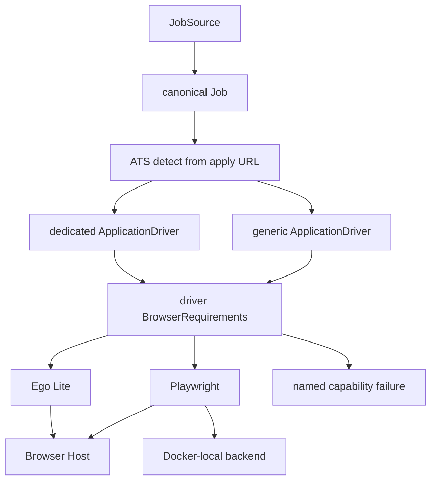
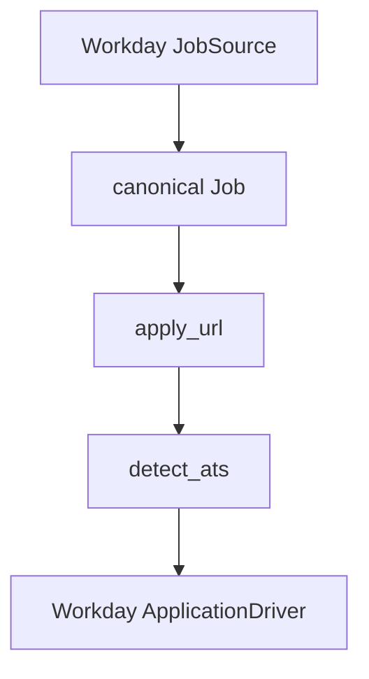

# Playwright, discovery sources, and ATS drivers

Playwright is already a real plugin at [`src/applyuminati/plugins/browsers/playwright_backend.py`](src/applyuminati/plugins/browsers/playwright_backend.py), registered as `applyuminati.browsers` / `playwright`, implementing `BrowserBackend`, with honest capability metadata and `PluginMaturity.HEALTH_PROBE_WORKING`. This work finishes that plugin, then ports ApplyPilot *behavior* (not code; ApplyPilot is AGPL-3.0, ideas only) into Applyuminati contracts.

ApplyPilot lives as a sibling repo at `/Users/spenceratgraybox/Work/_Personal/ApplyPilot` (not a submodule). Use it as research input only. Do not copy files, TLS-client patches, fake Chrome user-agents, Patchright stealth, or anti-blocking work. The JobDataAPI expansion list is in `ApplyPilot/PLAN_jobdataapi_methodologies.md` and already overlaps [`docs/ats-roadmap.md`](docs/ats-roadmap.md).

Execute as sequential PRs. Do not land this as one branch. PR 1 branch: `playwright-semantic-locators`. Do not block on a ticket system this repository does not currently require.

Central boundaries this plan must not blur:

- Playwright and Ego are browser implementations
- `JobSource` discovers
- `ApplicationDriver` applies
- The apply URL selects the driver
- Capability requirements select the browser
- HITL is the response to barriers; never defeat them

**Execution guardrails (not optional):**

1. `PUBLIC_FORM_APPLICATION` means Playwright is *eligible*, not *preferred*. Selection still uses configured `settings.browser.preferred` and availability. Ego Lite may win when both backends satisfy the requirements.
2. The generic driver (PR 19) must not dynamically downgrade its requirements after Playwright is already selected. If a public form later reveals login, CAPTCHA, MFA, or another handoff need, pause with a named capability mismatch and rebind to an interactive backend when the workflow model allows it. Do not fake HITL inside Playwright.

---

## Current constraints the plan must respect

**Locator bug (PR 1).** [`PlaywrightSession._extract_controls`](src/applyuminati/plugins/browsers/playwright_backend.py) assigns the CSS type selector (for example `input[type='text']`) as every matching element's `locator`. [`PageElement.locator`](src/applyuminati/browser/base.py) is backend-opaque: only the backend that produced it may interpret it. [`split_locator`](src/applyuminati/plugins/browsers/shared.py) currently understands `css=`, `role=`, `xpath=`, `ref=`, and `aria=` only. It does **not** define `label=` or `placeholder=` engines. Do not make Playwright selector syntax the cross-backend locator standard. Shared code may normalize control *metadata*. Locator *strings* stay backend-owned.

**Shared scanner docs.** [`CONTROL_SCAN_CALL_LITERAL`](src/applyuminati/plugins/browsers/shared.py) currently claims it is "injected into ego lite scripts and evaluated by the Playwright backend's JS eval." Playwright uses `_extract_controls()`, not that JS. Given backend-opaque locators, **correct the comment** rather than forcing both backends onto one scanner. Shared code normalizes semantic metadata. Each backend retains locator construction.

**Lifecycle bug (PR 2).** `PlaywrightBackend` keeps one browser and creates contexts, but `PlaywrightSession.close()` also calls `self._browser.close()`. Concurrent sessions will kill each other. Backend owns the Playwright driver and browser process. Session owns one `BrowserContext` plus pages.

**Capability honesty (PR 3, keep as-is).** Playwright must not claim `PERSISTENT_SESSION`, `HUMAN_HANDOFF`, or `AUTHENTICATED_USER_PROFILE`. `PERSISTENT_LOGIN` is earned only when `browser.playwright_storage_state` is set. Playwright `channel` / `executable_path` select a browser binary. They are not an authenticated human browser profile.

**Selection gap (PR 4, required or Playwright never runs a workflow).** Today:

- [`APPLICATION_SUBMISSION`](src/applyuminati/browser/capabilities.py) requires `HUMAN_HANDOFF`, so Playwright is never eligible for fill/submit.
- [`select_browser`](src/applyuminati/browser/selection.py) is used only in tests.
- [`run_application_attempt`](src/applyuminati/services/attempt_tasks.py) binds a Browser Host session, or pauses with "connect the Mac host". There is no Docker-local Playwright path.

**Host gap (PR 5).** The host already advertises Playwright via [`advertise_backends`](src/applyuminati/host/discovery.py), but [`HOST_UNDISPATCHABLE_CAPABILITIES`](src/applyuminati/host/dispatcher.py) strips `MULTI_TAB` and `DOWNLOADS`, and `OPEN_TAB` / `DOWNLOAD` raise `CAPABILITY_UNAVAILABLE`. [`BrowserSession`](src/applyuminati/browser/base.py) has no tab or download methods until PR 2. Playwright does not advertise `DOWNLOADS`. [`open_local_session`](src/applyuminati/host/client.py) defaults the slug to `ego_lite` when unset.

**Existing inventory (do not rebuild):**

- Sources: Greenhouse, Lever, local_feed (`applyuminati.sources`)
- Drivers: Greenhouse, Lever (`applyuminati.application_drivers`)
- ATS host hints already include Ashby, Workday, SmartRecruiters in [`detect.py`](src/applyuminati/applications/detect.py)
- [`AtsVendor`](src/applyuminati/core/models/job.py) already has ashby, workday, smartrecruiters, bamboohr, recruitee, teamtailor. Missing later: UKG, Oracle HCM, Hireology, Paylocity, Apploi, Zoho Recruit
- [`MemoryKind.WORKFLOW`](src/applyuminati/core/models/memory.py) already exists for "procedures that worked". [`MemoryRecord`](src/applyuminati/core/models/memory.py) already has `expires_at` and `superseded_by`. Successful-path memory belongs there, not in a new category.

Templates: [`greenhouse.py` source](src/applyuminati/plugins/sources/greenhouse.py), [`greenhouse.py` driver](src/applyuminati/plugins/applications/greenhouse.py), [`run_form_application`](src/applyuminati/applications/runner.py), [`build_job`](src/applyuminati/sources/normalize.py).



---

## Plugin lineage (sources and drivers)

Add provenance so dozens of integrations stay auditable. Keep [`PluginDescriptor`](src/applyuminati/core/registry.py) fields **minimal**:

- `strategy`
- `research_references`

Do **not** add `upstream_reference` pointing at `ApplyPilot discovery/ashby.py`. That reads as source-code derivation from AGPL ApplyPilot. The intent is independent reimplementation informed by research.

```text
slug: ashby
kind: source
strategy: public_api
research_references:
  - https://github.com/spencerthayer/ApplyPilot/blob/main/src/applypilot/discovery/ashby.py
maturity: adapter_exists
```

`strategy` values at minimum: `public_api`, `credentialed_api`, `browser_discovery`, `detect_only`, `employer_site`, `community`, `feed`.

`blocking` stays on [`SourceMetadata`](src/applyuminati/sources/base.py), not on the generic descriptor. Drivers do not need blocking posture.

`research_references` are URLs or notes. They are not a license to copy AGPL code.

Land the descriptor fields when the first new source (Ashby, PR 7) needs them, and backfill Greenhouse/Lever/local_feed in that same PR. `applyuminati capabilities` should print `strategy`. Source listings already print `blocking`.

"Detect-only" is not a `PluginMaturity` value. It means `BlockingBehavior.PROHIBITED` plus `strategy: detect_only`: recognize URLs/provenance, do not scrape.

---

## Phase 1: finish the Playwright plugin

### PR 1: semantic locators and control extraction

Keep locator construction inside [`playwright_backend.py`](src/applyuminati/plugins/browsers/playwright_backend.py). Do not extend `split_locator` with Playwright-only engines (`label=`, `placeholder=`) unless a documented cross-backend grammar is introduced later. Shared *metadata* extraction in [`shared.py`](src/applyuminati/plugins/browsers/shared.py): role mapping, labels, required/disabled, options, `detect_condition`. No ATS-specific behavior.

**Fix the `CONTROL_SCAN_CALL_LITERAL` docstring** so it no longer claims Playwright evaluates that JS. Do not converge Ego and Playwright onto one scanner in this PR.

Playwright locators must uniquely identify one element and be serializable strings (Browser Host round-trips `locator: str`). Do not store in-memory Locator objects. Construction priority inside Playwright:

1. `id`
2. `name` (plus `value` for radios)
3. `aria-label` / accessible name
4. associated `<label>`
5. `role`
6. `placeholder`
7. `data-*` (testid, qa, and similar)
8. CSS fallback with `nth=`

Uniqueness check: count matches; if more than one, add specificity. Playwright `page.fill` / `page.click` interpret *this backend's* strings. Ego keeps producing Ego locators.

**Keep `ElementRole` unchanged.** Do not add `COMBOBOX` in PR 1. Mapping:

- Native `<select>` → `SELECT`
- ARIA `role="combobox"` backed by a text-entry control → `TEXTBOX`
- ARIA `role="combobox"` that behaves as a pure selection widget → `SELECT`
- Preserve the original HTML/ARIA type in optional `PageElement.input_type` (Ego and existing fakes stay compatible: default `None`)
- Add `ElementRole.COMBOBOX` later only when a driver or questionnaire policy needs behavior that `TEXTBOX`/`SELECT` cannot express

Extract as `PageElement`s: text, email, phone, number, date, textarea, select, checkbox, radio groups, comboboxes (mapped as above), buttons, links, file inputs, contenteditable, custom ARIA controls. Map email/phone/number/date to `TEXTBOX` with `input_type`. Map contenteditable to `TEXTBOX`. Radio groups: one `PageElement` per option, unique locator, shared `name`.

Replace Playwright's private `_detect_condition` with [`detect_condition`](src/applyuminati/plugins/browsers/shared.py).

**Question mapping: smaller than full questionnaire extraction.** [`PageObservation.questions`](src/applyuminati/browser/base.py) exists, and the runner fills via `question.field_locator`, but live observe paths only populate `elements`. Add a shared helper that may emit `ApplicationQuestion` objects. Keep it backend-agnostic and ATS-free. It uses metadata and the opaque locator as-is; it does not parse Playwright syntax.

Emit a question **only** when all of these hold:

- a label or accessibility name exists
- the control accepts applicant input (`TEXTBOX`, `TEXTAREA`, `SELECT`, `CHECKBOX`, `RADIO`)
- a locator exists

Leave as `PageElement` only, not questions: buttons, ordinary links, file uploads, navigation controls, search boxes, and generic contenteditable regions, unless their semantics clearly indicate an application answer. Do not turn "Next", "Upload resume", or site search into questionnaire records.

Tests: HTML fixtures with two text inputs, labeled fields, radio group, combobox-as-textbox/select, file input, contenteditable, a Next button, and a search box. Assert locators are unique; Playwright `fill_field` / `click` hit the intended node; Next/search/upload are elements and not questions. Mark real Chromium with `@pytest.mark.browser`.

### PR 2: session lifecycle, tabs, downloads

- `PlaywrightBackend`: owns `async_playwright` + browser; tracks open contexts; `aclose` closes remaining sessions then the browser.
- `PlaywrightSession`: owns one context, pages, active tab; `close` saves storage state, closes context, does **not** close the browser.
- Multiple simultaneous sessions, each with its own context.
- `open_session(..., resume=)` currently ignores `BrowserCheckpoint`. A Playwright resume may reload storage state and navigate to the checkpoint URL. It must not pretend to restore a task space.

**Tab value model, not backend objects.** Tabs cross the Browser Host boundary. Add to [`browser/base.py`](src/applyuminati/browser/base.py):

```python
class BrowserTab(BaseModel):
    id: str
    url: str
    title: str | None
    active: bool
```

Protocol methods:

```python
async def list_tabs() -> list[BrowserTab]
async def open_tab(url: str | None = None) -> BrowserTab
async def close_tab(tab_id: str) -> ActionResult
async def activate_tab(tab_id: str) -> ActionResult
```

Do not return Playwright `Page`, Ego references, or any backend-specific handle. `BrowserSession` continues to hide CDP and implementation details.

This is an **interface-wide** change in the same PR:

- [`browser/base.py`](src/applyuminati/browser/base.py)
- [`ego_lite.py`](src/applyuminati/plugins/browsers/ego_lite.py) (implement or return a clear capability error)
- [`hosted_session.py`](src/applyuminati/services/hosted_session.py)
- fake sessions in tests
- [`host/dispatcher.py`](src/applyuminati/host/dispatcher.py)
- [`host/client.py`](src/applyuminati/host/client.py)
- host protocol tests

**Download result model.** Do not return a bare path string. Add:

```python
class BrowserDownload(BaseModel):
    id: str
    filename: str
    relative_path: str
    mime_type: str | None = None
    size: int | None = None
    source_url: str | None = None
```

The file lands only under an allowed Applyuminati directory (artifacts / downloads under the data dir). Advertise `DOWNLOADS` only once this API exists. Host dispatch of `DOWNLOAD` can wait until PR 5 if the protocol still strips it, but the session method and model land here so PR 5 does not invent a second shape.

Tests: two sessions, close one, the other still navigates; session close does not kill the backend; `aclose` after sessions; tab list/open/activate/close round-trip `BrowserTab`; Ego and HostedBrowserSession still satisfy the Protocol; no test returns a Playwright Page.

### PR 3: persistence without Ego cosplay

Expand [`BrowserSettings`](src/applyuminati/core/settings.py) with optional:

- `playwright_storage_state` (already present)
- download directory (allowed path only)
- proxy
- `channel` / `executable_path`: which Playwright browser *binary* to launch. Not a user Chrome profile. Not `AUTHENTICATED_USER_PROFILE`.

`storage_state` already covers cookies and localStorage. A restart may restore login when that file exists. It must not restore page/task space (`task_space_id` stays `None`). Do not add `PERSISTENT_SESSION`, `HUMAN_HANDOFF`, or `AUTHENTICATED_USER_PROFILE`.

The static `PLUGIN` descriptor currently advertises `_CAPABILITIES` without conditional `PERSISTENT_LOGIN`. Selection uses `backend.metadata` (correct). Keep the descriptor honest: login is config-dependent, not a static capability.

Tests already in [`tests/test_browser_capabilities.py`](tests/test_browser_capabilities.py) must keep failing if those claims appear.

### PR 4: driver requirements and real browser selection

This PR exists so `select_browser()` leaves the test suite and becomes the execution policy. Do not also add Docker-local sessions or host tab dispatch here.

Requirement tiers:

- `PUBLIC_FORM_APPLICATION`: required `{NAVIGATE, SEMANTIC_SNAPSHOT, FILE_UPLOAD}`; `HUMAN_HANDOFF` preferred, not required. Greenhouse and Lever use this. Playwright is eligible. Playwright is not automatically preferred. Ego Lite may still be selected when both qualify, via `settings.browser.preferred`.
- `APPLICATION_SUBMISSION`: requires stronger execution properties, including `HUMAN_HANDOFF`.
- `AUTHENTICATED_APPLICATION`: requires persistent / authenticated interactive behavior (`PERSISTENT_LOGIN`, `HUMAN_HANDOFF`, and the existing preferred set).

Drivers declare needs. Browser-selection code does not know ATS names. Capability matching is a veto; preference order is a ranking among survivors.

Keep the declaration on [`DriverMetadata`](src/applyuminati/applications/driver.py), not on `ApplicationAttempt`. The attempt persists the **resolved** backend slug and a requirements snapshot for audit/resume. The driver remains the source of the policy.

Wire [`select_browser`](src/applyuminati/browser/selection.py) into attempt creation / `AttemptService`. [`open_local_session`](src/applyuminati/host/client.py) must receive `attempt.browser_backend` instead of defaulting to `ego_lite`.

When Playwright is selected and a challenge appears, `handoff_for` still opens HITL. Playwright `request_human_control` continues to refuse. Named failure, not a stealth fallback to Ego.

Tests: Greenhouse/Lever public-form requirements allow Playwright; Workday-class `AUTHENTICATED_APPLICATION` rejects Playwright; attempt records selected backend plus requirements snapshot; core has no `if greenhouse` in selection.

If this PR's test surface stays reviewable, keep it as one PR. If it grows past driver metadata plus selection wiring, stop here and do not sneak in local execution.

### PR 5: Docker-local Playwright and Browser Host operations

Depends on PR 2 (tab/download models) and PR 4 (selection).

Two Playwright execution paths. Ownership must be explicit:

1. Applyuminati process → local `PlaywrightBackend`
2. Applyuminati → Browser Host → `PlaywrightBackend`

**Local ownership.** The service that selects and opens the backend also owns deterministic cleanup. Do not construct a fresh process-wide backend in every task execution and leak Chromium. A small local browser manager or registry-backed backend pool is enough. No new service framework. Session close returns the context to the pool or closes it; process shutdown / `aclose` closes the browser. Host-backed sessions stay owned by the host; local cleanup must not close a host browser.

**Docker-local path:** `AttemptService.bind_session` / `run_application_attempt` opens a local Playwright session when no host is connected **and** the driver's requirements are satisfied by Playwright. If they are not, keep the current "connect Browser Host" pause. Never silently pick Playwright for Workday-class flows.

**Browser Host path:** implement host tab/download commands against the PR 2 session methods, returning `BrowserTab` / `BrowserDownload`. Reconstruction after host restart must fail honestly for Playwright (no task space). Ego reconstruction stays as it is.

Tests: capability advertisement, remote observe/fill/upload/screenshot/download, session create/close, storage-state close, host reconstruction limitation, local Playwright path when no host and requirements match, HITL pause when they do not, no leaked browser after task completion.

### PR 6: live validation and maturity

Controlled live flows against public Greenhouse and Lever boards, using the wired selection path (not a test factory):

1. `research_only`
2. `fill_without_submit`
3. One authorized real submission

A successful live Greenhouse/Lever run through that path moves Playwright to `workflow_integrated`.

`production_tested` is stricter. It requires a separately documented successful live execution under a defined test matrix (modes, ATS, backend, host vs local, handoff refusal). It is not "somebody ran it once." Nothing in-repo claims `production_tested` until that matrix is written and executed.

Docs (ARCHITECTURE, deployment, execution-architecture, capabilities CLI notes): Playwright is for workflows that do not need persistent browser sessions or live human handoff. Applyuminati will not silently select it when the application requires capabilities it cannot provide.

Update [`tests/test_docs_consistency.py`](tests/test_docs_consistency.py) when maturity changes.

---

## Phase 2: migrate ApplyPilot discovery into JobSource

Port behavior, not code. ApplyPilot's implemented discovery surface is Greenhouse, Lever, Ashby, Workday, Amazon, Costco, Hacker News, Built In, SmartExtract, and JobSpy-backed Indeed/LinkedIn/Glassdoor/ZipRecruiter.

Each source: `discover` never raises for expected failures; `build_job` for canonical `Job`; `strategy` + `research_references` on the descriptor; `blocking` on `SourceMetadata`; register both the [`pyproject.toml`](pyproject.toml) entry point and [`register_sources()`](src/applyuminati/plugins/sources/__init__.py); HTTP tests with `respx`. Start at `adapter_exists`.

### PR 7: Ashby JobSource (first migration)

Files: `src/applyuminati/plugins/sources/ashby.py`, `tests/test_source_ashby.py`, register `ashby = applyuminati.plugins.sources.ashby:PLUGIN`.

Use Ashby's public Job Postings API, not scraping:

`GET https://api.ashbyhq.com/posting-api/job-board/{JOB_BOARD_NAME}?includeCompensation=true`

Options: list of board slugs (same pattern as Greenhouse `boards`). Map `id`, `title`, company from board/options, `descriptionPlain` / HTML stripped via `build_job`, location / `isRemote` / `workplaceType`, compensation when present, `publishedAt`, `jobUrl`, `applyUrl`, `ats=ASHBY`, `last_verified` via `verify`. Skip `isListed is False`. Blocking: `NONE` or `RATE_LIMITED`. Strategy: `public_api`. Follow [`SourceHttpClient`](src/applyuminati/sources/http.py).

Also land `strategy` / `research_references` on `PluginDescriptor` and backfill existing sources.

### PR 8: Workday JobSource

Files: `src/applyuminati/plugins/sources/workday.py`, `tests/test_source_workday.py`.

Understand tenant identity: `*.myworkdayjobs.com`, tenant, site, locale, requisition IDs. **Discovery and normalize only. No apply.** ApplyPilot's Workday knowledge is substantial; extract only discovery behavior. No shared Workday "god plugin."



The ApplicationDriver is PR 20. Options: list of `{tenant, site, host?}`. Blocking: `RATE_LIMITED` (and `BOT_CHALLENGE` if the CXS endpoint requires a browser). If challenged, record `SourceFailure`, do not impersonate browsers.

### PR 9–11: Amazon, Costco, Hacker News

Amazon and Costco are architectural tests, not just more boards. They prove:

- source is not ATS
- company is not ATS
- application URL decides the driver

Amazon discovery may later yield jobs whose apply flow is employer-specific, an ATS driver, or the generic driver. That is what the architecture must permit. Keep `SourceTier.EMPLOYER_SITE` and `AtsVendor.CUSTOM` (or `UNKNOWN` until `detect_ats` on the apply URL). Do not invent a Phenom/iCIMS driver from Costco alone.

- Amazon: public JSON `https://www.amazon.jobs/en/search.json`; job URLs on `amazon.jobs`. Honest UA. Strategy: `employer_site` or `public_api`.
- Costco: public JSON `https://careers.costco.com/api/jobs` (Phenom/iCIMS-backed). Same treatment.
- HN: Algolia "Who is hiring" plus Firebase item fetch. ApplyPilot does not persist thread ID, comment ID, or comment author. Applyuminati should store those on `JobSourceRecord.raw` along with external employer URL and application URL. Strategy: `community`. Most HN jobs have `AtsVendor.UNKNOWN` until apply-URL detection.

Downstream for all three: posting → Job → resolve apply URL → `detect_ats` → dedicated or generic driver.

### PR 12: Built In

Verify the current permitted access mechanism before automating. If permitted, `applyuminati.sources.builtin` with honest User-Agent (project identity, not fake Chrome). If not, `strategy: detect_only` and `BlockingBehavior.PROHIBITED`. Do not port ApplyPilot's Chrome UA impersonation.

### PR 13: generic feeds

First-class sources: RSS, Atom, JSON, configurable HTTP API. Local file already proves the non-HTTP path. `SourceTier.DERIVED`, strategy `feed`.

---

## Phase 3: dedicated application drivers (before generic)

Do not build `generic_browser` or the generic ApplicationDriver first. Dedicated implementations provide the evidence needed to design a useful generic contract. Four drivers (Greenhouse, Lever, Ashby, SmartRecruiters) is the stop-and-evaluate point for whether [`run_form_application`](src/applyuminati/applications/runner.py) is actually generic.

### PR 14: Ashby ApplicationDriver

`src/applyuminati/plugins/applications/ashby.py`, register `applyuminati.application_drivers`. Same runner. Driver supplies: URL detection (`jobs.ashbyhq.com`), submit-button matching, question/field hints, step/success evidence. `PUBLIC_FORM_APPLICATION` on `DriverMetadata`. Tests like [`tests/test_drivers.py`](tests/test_drivers.py). No `if ashby` in core.

### PR 15–16: SmartRecruiters source then driver

Public postings API: `GET https://api.smartrecruiters.com/v1/companies/{slug}/postings`. Then a dedicated driver with the same `PUBLIC_FORM_APPLICATION` pattern.

---

## Phase 4: learning, then generic fallbacks

### PR 17: structured successful-path memory

Land the workflow-memory **substrate** here, before both generic systems. Four dedicated drivers can populate it. The generic driver later consumes a model already proven against structured ATS workflows. Do not invent memory behavior inside the generic-driver PR.

ApplyPilot records recent successful tool sequences and treats them as hints, not scripts. Do not copy JSON tool-call logs. Reimplement through [`MemoryKind.WORKFLOW`](src/applyuminati/core/models/memory.py) with semantic checkpoints in `MemoryRecord.data`. Use existing `expires_at` and `superseded_by`.

Example payload:

```text
ATS: greenhouse
driver_version: ...
browser_backend: ego_lite
successful sequence:
  application_opened
  personal_information
  resume_uploaded
  screening_questions
  demographic_questions
  review
  submission_confirmed
human interventions: none
observed variations:
  phone country selector
  voluntary demographic section
```

Also store: employer/domain, captured_at, duration, questions encountered, submission evidence, expires_at.

**Consumers:** Greenhouse, Lever, Ashby, SmartRecruiters, and later the generic driver. Same records. Hints only. Never auto-replay a click path without observing the current page. Layout drift or a failed resume supersedes the record.

Wire write-on-success into the shared runner (or a helper it calls) so dedicated drivers get it without per-ATS branches. Read-side is optional in this PR for Greenhouse/Lever tests with a fake store.

### PR 18: generic browser JobSource

`applyuminati.sources.generic_browser`: agent/browser-assisted JobSource for career pages without a dedicated plugin.

company careers URL → `BrowserBackend` → semantic observations → LLM/agent extraction → normalized Jobs → provenance + confidence.

Uses Ego or Playwright via capability selection (`READ_ONLY_INSPECTION` is enough). Honors blocking posture. Never defeats anti-automation. Do not port `smartextract.py`. Strategy: `browser_discovery`.

### PR 19: generic ApplicationDriver

`applyuminati.application_drivers.generic`. Lowest detection confidence. [`detect_driver`](src/applyuminati/applications/driver.py) currently fails the attempt when nothing matches; change that to fall back to generic instead of `FAILED`.

Use existing primitives: `ApplicationAttempt`, checkpoints, questionnaire policy, claim provenance, browser capabilities, Needs you, submission evidence, **and PR 17 workflow memory**. Observe → classify step → extract controls → answer from verified profile/policy → act → checkpoint → repeat. Human barriers become HITL. Not a giant prompt.

Declare requirements on `DriverMetadata` *before* backend selection. Do not start on Playwright under `PUBLIC_FORM_APPLICATION` and then quietly lower the bar when a login wall appears.

If an initially public form later reveals login, CAPTCHA, MFA, or another handoff requirement: pause with a clear capability mismatch (Playwright cannot `HUMAN_HANDOFF`), persist the attempt, and allow rebinding to an interactive backend (Ego / Browser Host) where the workflow model permits it. Playwright `request_human_control` stays an honest refusal. Never fake HITL inside Playwright.

---

## Phase 5: Workday apply, remaining ATS, aggregators

### PR 20: Workday ApplicationDriver

Only after generic driver, successful-path memory, and Browser Host/Ego handoff are real. Workday is why Browser Host exists: account creation, login, persistent credentials, MFA, CAPTCHA handoff, multi-page wizard, repeated employment/education, questionnaires, resume parsing, review, submission evidence, restart recovery.

Separate plugin from the PR 8 JobSource. Driver requirements: `AUTHENTICATED_APPLICATION` on `DriverMetadata`. Ego Lite wins. Playwright must not be selected.

### PR 21+: remaining ATS

- UKG / UltiPro: discovery + dedicated driver (add `AtsVendor` members)
- Oracle HCM: discovery + dedicated driver
- Hireology, Paylocity, BambooHR: discovery; generic driver first
- Teamtailor, Recruitee, Zoho Recruit: credentialed discovery; generic first
- Apploi: investigate first; generic unless a clean public surface exists

Rule: build a JobSource when a legitimate acquisition mechanism exists. Build a dedicated ApplicationDriver only when the generic driver demonstrably needs ATS-specific behavior.

Update [`docs/ats-roadmap.md`](docs/ats-roadmap.md) as each plugin lands.

### PR N: aggregators (last)

Independent registry entries even if they share internals:

- `applyuminati.sources.linkedin`
- `applyuminati.sources.indeed`
- `applyuminati.sources.glassdoor`
- `applyuminati.sources.ziprecruiter`
- optional shared `plugins/sources/_jobspy.py`

Each PR must establish the permitted acquisition method first. LinkedIn is `detect_only` / `PROHIBITED` unless a permitted method exists. ApplyPilot already dropped ZipRecruiter from JobSpy defaults (Cloudflare 403, 2026-06-10); do not treat that board as a working scrape. Do not copy JobSpy TLS-client `chrome_120` patches, proxies, or impersonation.

---

## PR sequence

**Playwright**

1. Semantic controls (backend-owned locators, conservative questions, docstring fix)
2. Lifecycle + `BrowserTab` / `BrowserDownload`
3. Persistence / binary configuration
4. Driver requirements + real `select_browser()` wiring
5. Local manager + Browser Host Playwright operations
6. Live validation (`workflow_integrated`; `production_tested` only via documented matrix)

**Discovery**

7. Ashby JobSource (`strategy` + `research_references`)
8. Workday JobSource (discovery only)
9. Amazon JobSource
10. Costco JobSource
11. Hacker News JobSource
12. Built In policy review + source / detect-only
13. RSS / Atom / JSON / API feeds

**Dedicated applications**

14. Ashby ApplicationDriver
15. SmartRecruiters JobSource
16. SmartRecruiters ApplicationDriver

**Learning + fallbacks**

17. Structured successful-path memory (`MemoryKind.WORKFLOW`)
18. Generic browser discovery
19. Generic ApplicationDriver
20. Workday ApplicationDriver

**Complex ATS + aggregators**

21+. UKG / Oracle / remaining systems
N. Aggregators only after independent policy review

---

## First implementation batch

PRs 1–6 are the first shippable milestone (Playwright productionized, selection no longer test-only). Discovery PRs 7+ can proceed in parallel after PR 4 if needed; they do not depend on Playwright except PR 18.

---

## Close-out: README

The last implementation task, after the work that actually landed, is to update [`README.md`](README.md) so **Current implementation status** matches the code: Playwright maturity and honest capabilities, which JobSource and ApplicationDriver plugins exist, Browser Host vs local execution, driver-declared requirements, and that aggregators / stealth scraping are not implemented. Do not describe planned work as if it were shipped.
